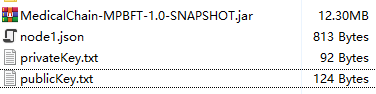
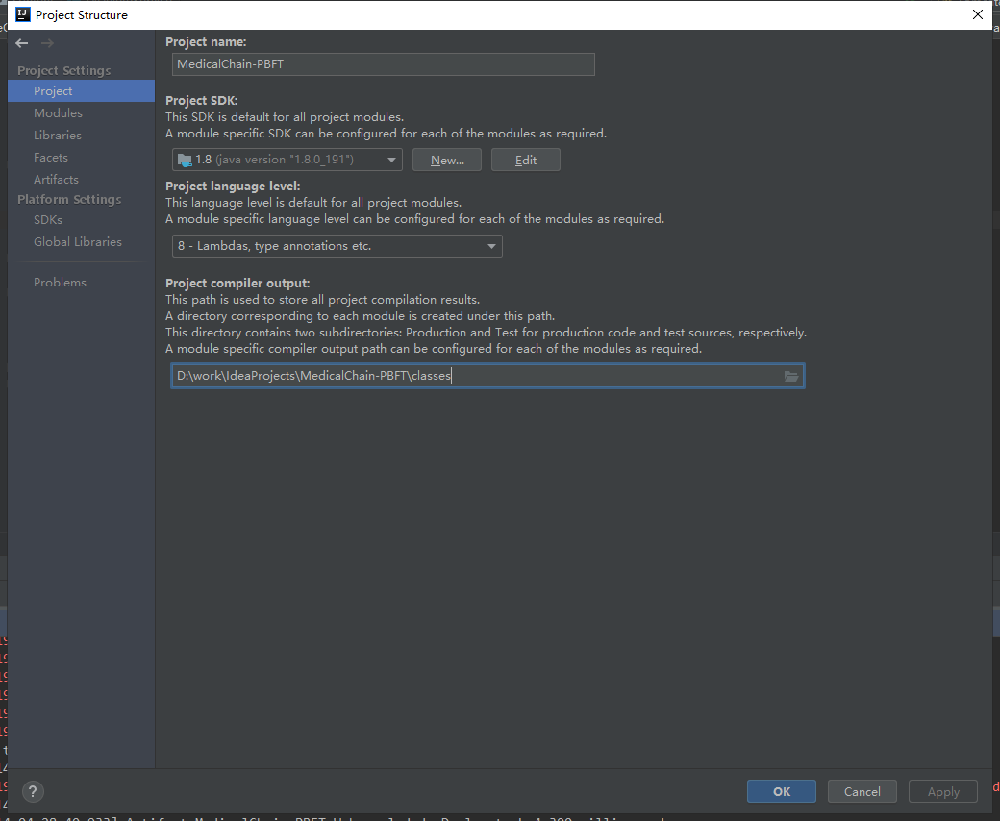
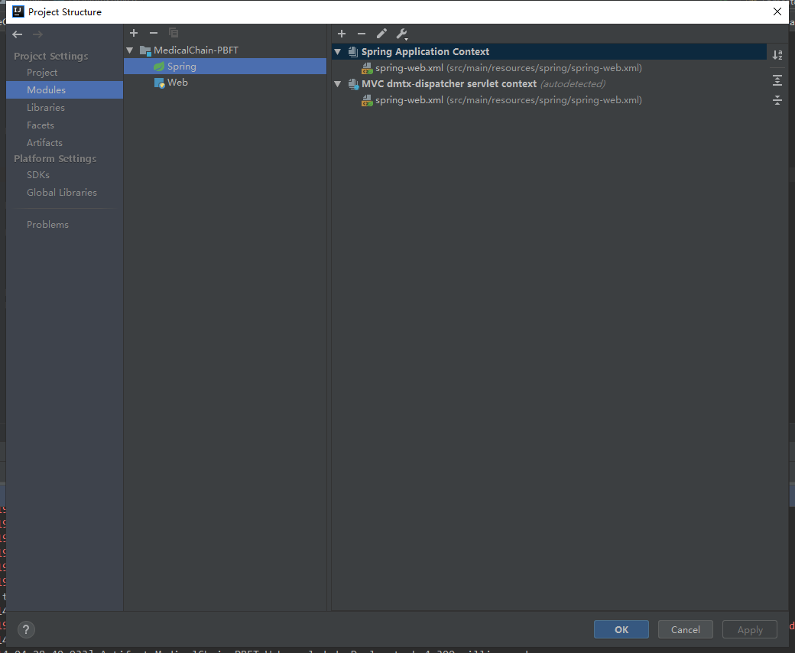
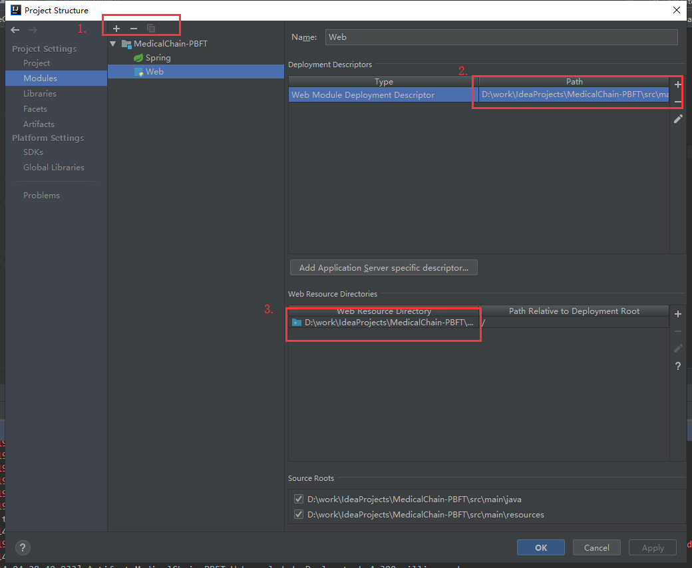
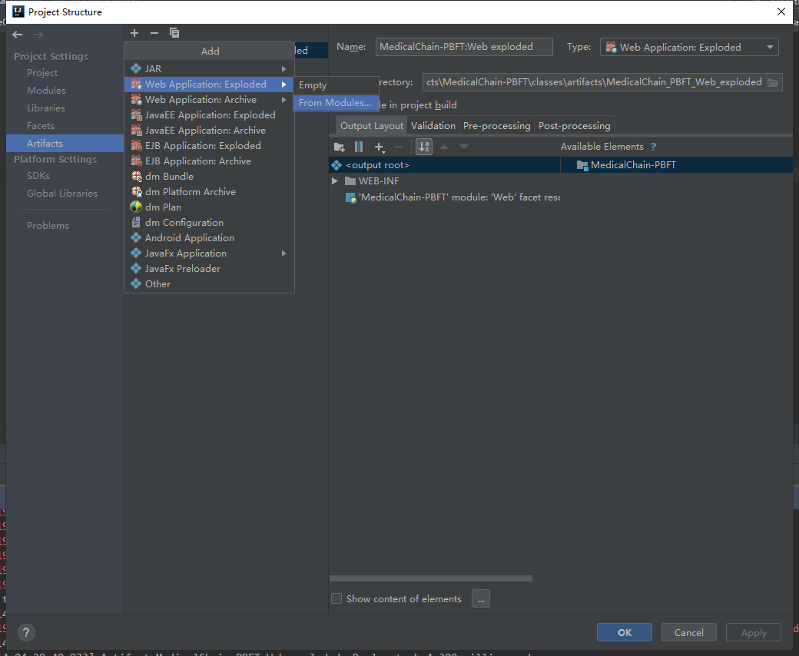
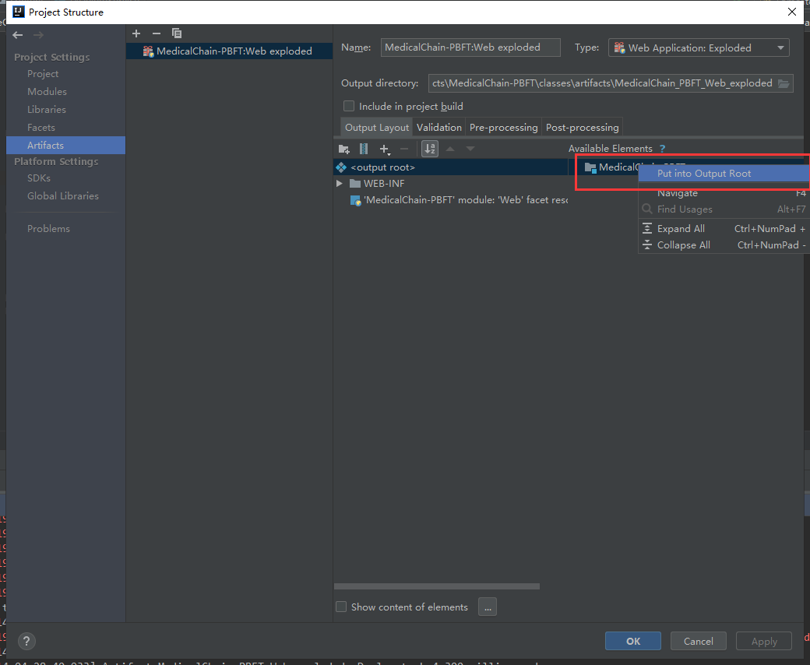
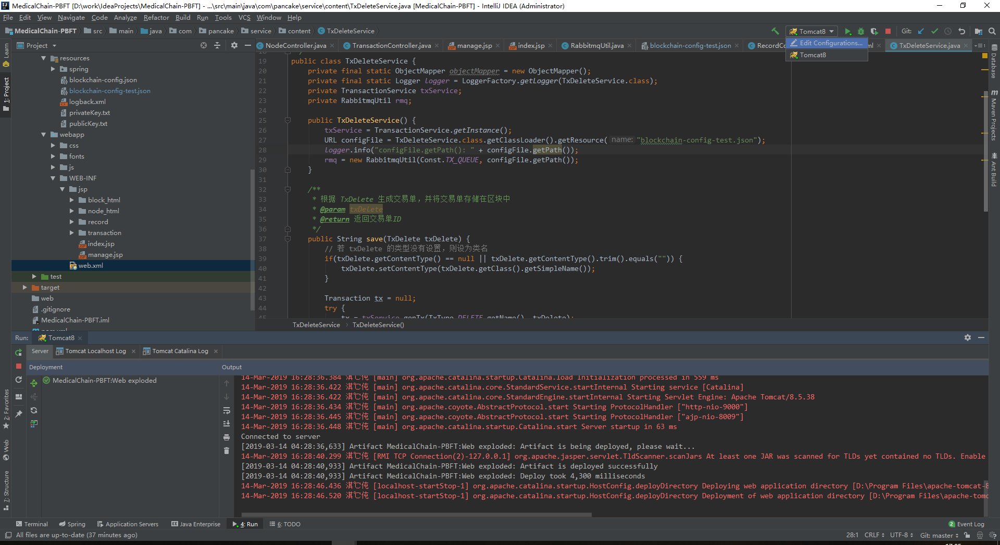
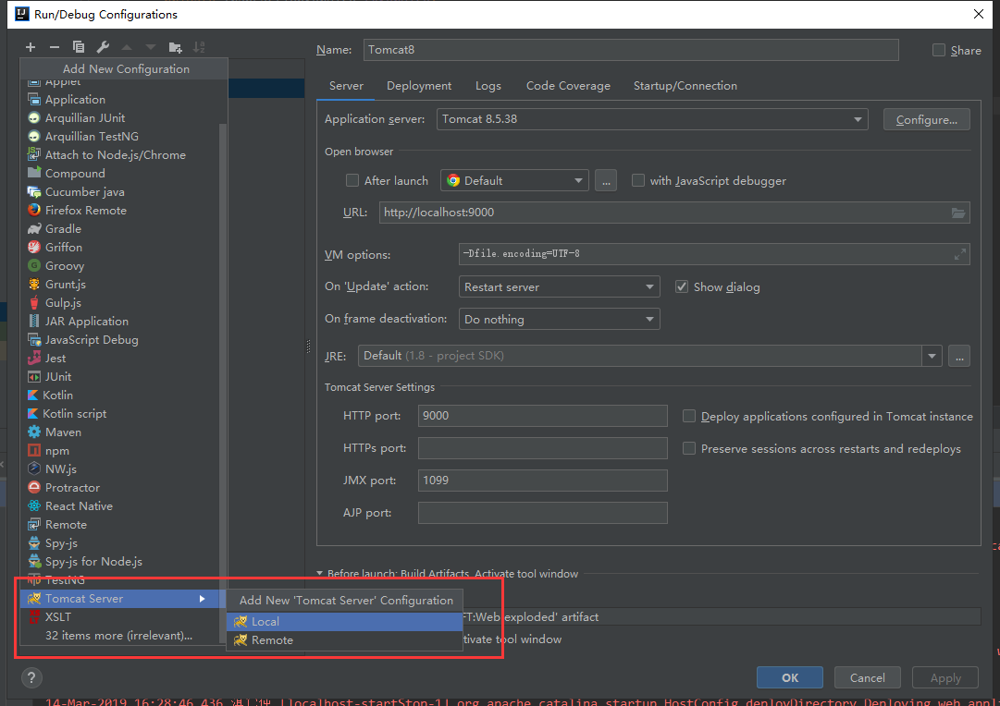

1. build项目jar包：
* 在`MedicalChain-MPBFT\`目录下执行`mvn -Dmaven.test.skip=true  assembly:assembly`命令，将会在`MedicalChain-MPBFT\target`下生成`MedicalChain-MPBFT-1.0-SNAPSHOT.jar`。
	
2. 自动生成json配置文件的方法
* 打开`MedicalChain-MPBFT\src\test\com\pancake\util\RunUtil.java`
* 修改函数`getNodes()`函数中的ip
```
    public NetAddress[] getNodes() {
        NetAddress[] nodes = {new NetAddress("203.195.231.164", 8000),
                new NetAddress("111.230.222.202", 8000),
                new NetAddress("139.199.18.78", 8000),
                new NetAddress("129.204.79.50", 8000)};
        return nodes;
    }
```
* 运行`generateConfigFile()`函数，生成四个配置文件，路径为`MedicalChain-MPBFT\nodeX.json`

3. 节点环境配置

* 每台机器所需的文件如下：



* `privateKey.txt`和`publicKey.txt`可以在`MedicalChain-MPBFT\src\main\resources\`中找到
* `MedicalChain-MPBFT-1.0-SNAPSHOT.jar`由`maven build` 生成

4. 系统启动流程

* 执行 `java -jar MedicalChain-MPBFT-1.0-SNAPSHOT.jar  -v node1.json`启动`Validator`
* 执行 `java -jar MedicalChain-MPBFT-1.0-SNAPSHOT.jar  -t node1.json`在节点1上启动`Transaction Transmitter`

5. mongodb dump 命令

```
mongoexport -d BlockChain -c 129.204.52.140:8000.CommitMsgCount -o export --type json -u blockchain -p zc-12332145

```
关闭mongodb打印的方法
```
Logger log = Logger.getLogger("org.mongodb.driver");   
log.setLevel(Level.OFF);   
```
6. MedicalChain Web 配置
* 打开 project structure
* 设置 jdk



*  添加 spring



*  添加 web，2处填`D:\work\IdeaProjects\MedicalChain-PBFT\src\main\webapp\WEB-INF\web.xml`,3处填`D:\work\IdeaProjects\MedicalChain-PBFT\src\main\webapp`。注意`D:\work\IdeaProjects\`为项目所在目录。



* 创建 Artifacts



* 添加项目引用 jar 包，在MedicalChain-PBFT处右击，选择`Put into Output Root`，否则会出现`java.lang.ClassNotFoundException: org.springframework.web.context.ContextLoaderListener`错误



* 添加 tomcat 服务器




7.开启mongo身份认证
'''

mongo	
> use admin	# 创建admin数据库
> db.createUser({user:"admin",pwd:"admin",roles:["root"]}) # 创建一个用户名为admin，密码为admin，身份为管理员的User
> db.auth("admin","admin") # 进行认证
1		# 显示1，认证成功

> use demo1 # 切换数据库
switched to db demo1

 # 创建一个用户名为demo1user，密码为demo1，身份为数据库用户，拥有demo1的User
> db.createUser({user:"demo1user",pwd:"demo1",roles:[{role:"dbOwner",db:"demo1"}]})
Successfully added user: {
	"user" : "demo1user",
	"roles" : [
		{
			"role" : "dbOwner",
			"db" : "demo1"
		}
	]
}

sudo mongod -f /etc/mongod.conf --auth # 认证模式启动

/etc/mongod.conf
security:
  authorization: enabled

'''
